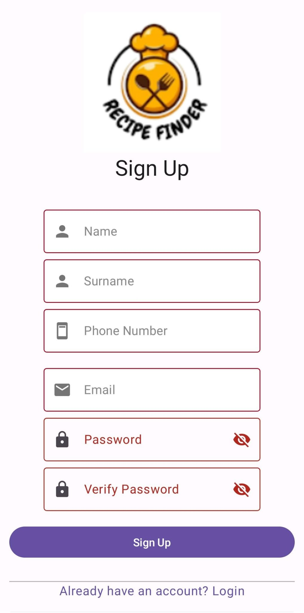

# Recipe Finder App

Welcome to Recipe Finder, your ultimate mobile app for discovering and saving delicious recipes! Whether you're a seasoned chef or a beginner in the kitchen, Recipe Finder provides you with a vast collection of recipes to explore and enjoy.

## Mission

At Recipe Finder, our mission is to provide users with a seamless and delightful cooking experience through a high-performance, modular, and memory-safe mobile application.

## Features

### Homepage

- Discover trending and popular recipes.
- Search for recipes by name, ingredient, or category.
- Filter recipes based on dietary preferences and cooking time.

### Authentication

- Securely sign up and log in to your account.
- Safeguard your personal data with Firebase authentication.

### Favorites

- Save your favorite recipes for quick access.
- Organize your saved recipes into custom categories.

### Ratings & Comments

- Rate and leave comments on recipes you've tried.
- Share your cooking experiences and tips with the community.

### Category Selection

- Explore recipes by category, including cuisine type, dietary restrictions, and more.

### Recipe Details

- View detailed information about each recipe.
- Follow step-by-step cooking instructions.

### Search

- Quickly find recipes by using the search feature.
- Apply filters to narrow down search results.

## Other features

- **API Integration:** Fetch recipe data from external APIs and parse JSON responses.
- **Firebase Database:** Store user data, favorites, and other app-related information securely in the cloud.
- **Authentication:** Implement user authentication using Firebase Auth for secure access to app features.
- **Modularity:** Design the app with a modular architecture to enhance scalability and maintainability.
- **Readability:** Write clean, well-documented code for easy understanding and collaboration.
- **Memory Safety:** Ensure memory safety by following best practices and leveraging language features where applicable.
